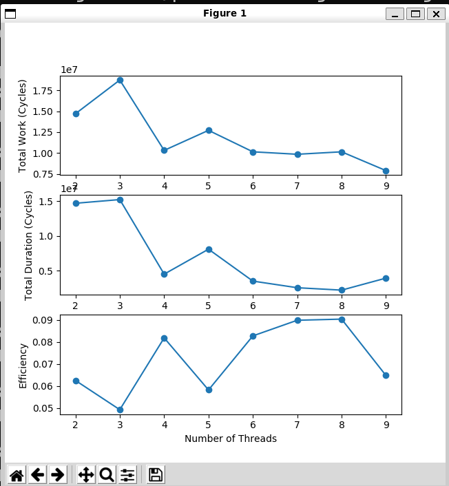

# PRAM Semigroup Problem

This project explores the PRAM (Parallel Random-Access Machine) semigroup problem, focusing on performing cumulative addition operations with a varying number of processors.

## Problem Statement

The goal of this project is to execute the cumulative addition operation in the form of a semigroup. We consider a range of processors, from 2 to 9, and apply them to an array containing values from 1 to 9.

## Results

### Semigroup Computation Details

In our investigation, we used multiple threads to copy the initial array and create new threads for each processor (denoted as 'p'). These threads were distributed evenly from the first to the last 'n/p' of the semigroup. The computation process involved taking the last elements of each 'n/p' segment in a chain and forming a new array. This process was repeated iteratively until the final result was obtained.

### Efficiency Analysis

We documented our findings in the `semigroup_thread.txt` file. The results from our experiments revealed interesting insights into the relationship between the number of threads (processors) and the efficiency of the semigroup computation.

According to the results illustrated in the following graphs, we observed the following trends:

- As the number of threads increased, the computation rate also increased, up to a certain point.
- Beyond this point (in our example, when the number of threads equals the 'p' value), the efficiency started to decrease.

These observations suggest that the efficiency of semigroup computations is influenced by the number of processors and highlights the importance of optimizing processor allocation for such parallel computations.

  

  

## Acknowledgments

This project was inspired by the concepts and techniques discussed in the "PINocchio" project (https://github.com/albf/PINocchio). We extend our gratitude to the creators and contributors of the "PINocchio" project for their valuable insights into parallel processing and PRAM-related topics.

## Conclusion

By investigating the PRAM semigroup problem and analyzing the results, we gain valuable insights into the efficiency of parallel computations and the impact of processor allocation. This project contributes to the broader understanding of parallel processing techniques and their applications.

Feel free to explore our findings further in the provided `semigroup_thread.txt` file and the associated code.

